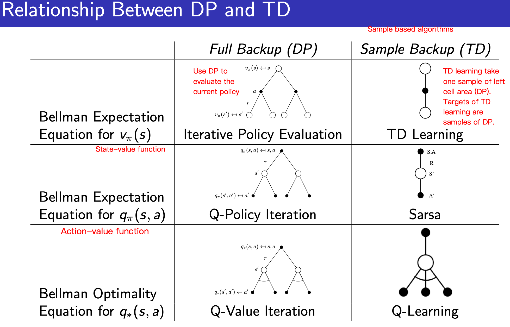

# ReinforcementLearing_UCL_DavidSilver

David Silver's website: https://www.davidsilver.uk/teaching/

## Textbook 

Textbook is *Reinforcement Learning: An Introduction* by Richard S. Sutton and Andrew G. Barto. [PDF here](SuttonBartoIPRLBook2ndEd.pdf).

## Lectures

### Lecture 1: Introduction to Reinforcement Learning
- [Annotated slide by me](./slides/lec1_intro_RL.pdf), [My note](notes/lec1_intro_RL.md)  
- RL diff form other ML
    - No supervisor, only a reward signal
    - Feedback is delayed, not instantaneous
    - Time reall y matters ( sequential, non i.i.d data)
    - Agent’s actions affect the subsequent data it receives
- Major Components of an RL Agent
    - Policy: is the agent’s behaviour. It is a map from state to action.
    - Value function: is a prediction of future reward. Used to evaluate the goodness / badness of states.
    - Model: A model predicts what the environment will do next
- Categorizing RL agents
    - Value Based vs Policy Based vs Actor Critic
    - Model free vs Model based
- Problems in RL
    - Learning and Planning
        - Learning: 
            - environment is initially unknown
            - agent interacts with the environment
            - agent improves its policy
        - Planning: 
            - environment is known
            - agent performs computations with its model ( without any external interaction )
            - agent improves its policy
    - Exploration and Exploitation
        - Reinforcement learning is like trial-and-error learning. The agent should discover a good policy. From its experiences of the environment.
    - Prediction and Control
        - Prediction: evaluate the future
            - Given a policy
        - Control: optimise the future
            - Find the best policy

### Lecture 2: Markov Decision Processes
- [Annotated slide by me](./slides/lec2_markov_decision_process_MDP.pdf), [My note](notes/lec2_MDP.md)  
- Markov Process 
    - Markov Chain <S, P>
        - S is a set of states
        - P is state transition probability matrix
        - P_ss' = P[ S_t+1 = s' | S_t = s ]
- Markov Reward Process MRP
    - is Markov Chain with values
    - <S, P, R, gamma>
        - R is a reward function, R_s = E[ R_(t+1) | S_t = s ]. R_s means, for time t and state s, how much reward we can get in t+1, i.e. R_(t+1).
        - gamma is a discount factor. gamma \in [0, 1]
    - Value function
        - Value function v(s) gives the long term value of state s
        - The state value function v(s) of an MRP is the expected return starting from state s
            - v(s) = E[ G_t | S_t = s ]
    - Solving the Bellman Equation - linear equation
        - Small DRP: solve directly, O(n^3)
        - Large DRP: 
            - Dynamic programming
            - Monte-Carlo evaluation
            - Temporal-Difference learning
- Markov Decision Processes MDP
    - is a Markov Reward Process with decisions
    - <S, A, P, R, gamma>
        - A is a finite set of actions
        - P^a_ss' = P[ S_t+1 = s' | S_t = s, A_t = a ]
        - R is a reward function, R^a_s = E[ R_(t+1) | S_t = s, A_t = a ]. R_s means, for time t and state s, how much reward we can get in t+1, i.e. R_(t+1).
    - Value Function
        - State-value function: tell us how good to be a specific state s
            - v_pi(s) = E_pi[ G_t | S_t = s ]
        - Action-value funtion: tell us how good to take a specific action from a specific state
            - q_pi(s, a) = E_pi[ G_t | S_t = s, A_t = a ]
    - Optimal Value Function
        - Solve q_*(s, a)
        - Finding an optimal policy  
    - Bellman Optimality Equation
        - Non-linear, no closed solution
        - iterative solution:
            - Value iteration
            - Policy iteration
            - Q-learning
            - Sarsa

### Lecture 3: Planning by Dynamic Programming （for unknown MDP/ model-based)
- [Annotated slide by me](./slides/lec3_planning_by_DP.pdf)

|Problem|Bellman Equation|Algorithm|Note|
|-|-|-|-|
|Prediction|Bellman Expectation Equation|Iterative Policy Evalucatin||
|Control|Bellman Expectation Equation + Greedy Policy Improvement|Policy Iteration|This policy iteration always converges to pi_*|
|Control|Bellman Optimality Equation|Value Iteration|Converge to v_*. There is no explicit policy. Intermediate value functions may not correspond to any policy.|
||

### Lecture 3-7:

- Lecture 3 Model-based: 
  - Planning by Dynamic Programming (DP). Solve a known MDP.
    - Policy Evaluation
    - Policy Iteration
    - Value Iteration
- Lecture 4-7 Model-free 
  - Lecture 4 Prediction: 
    - Esimate the value fucntion of an unknown MDP.
      - Monte-Carlo Policy Evaluation
      - Temporal-Difference Learning
      - TD(lambda)
  - Lecture 5 Model-free Control:
    - Optimize the value function of an unknown MDP.
      - On-Policy Monte-Carlo Control
      - On-Policy TD Learning
      - Off-Policy Learning
        - Q-Learning
  - Sacle up to real practical problems: Use function approximation.
    - Lecture 6: Function approximation for value based algorithms 
      - Incremental Methods
      - Batch Methods
        - DQN
    - Lecture 7: Function approximation for policy based algorithms
      - Finite-Difference Policy Gradient
      - Monte-Carlo Policy Gradient
      - Actor-Critic Policy Gradient

### Lecture 4: Model-Free Prediction (for unknown MDP)
- [Annotated slide by me](./slides/lec4_model_free_prediction_MC-TD.pdf)

|Planning By DP|Model-free Prediction|Model-free Control|
|-|-|-|
|Solve a known MDP|Estimate the value fucntion of an Unknown MDP|Solve an unknown MDP|
||

- Monte Carlo Policy Evaluation
  - Use empirical mean return, Use complete episode
    - First-visit VS Every-visit Monte-Carlo policy Evaluation
    - Incremental Monte-Carlo updates
    - Equation: V(S_t) <- V(S_t) + alpha * ( G_t - V(S_t) )
- Temporal Difference TD(0)
  - Use esitmated return of next state, Use partial episode 
    - Equation: V(S_t) <- V(S_t) + alpha * ( R_{t+1}+gamma*V(S_{t+1}) - V(S_t) )
- TD(lambda)
  - Instead of only consider one step ahead, we can consider n steps ahead. When n = infinite, TD(lambda) = MC.
  - TD(lambda) weighting equation
    - Forward View: Using weight (1 − λ)*λ^{n−1}. Sum = 1.
    - Backward View: Using eligibility trace. 

### Lecture 5: Model-Free Control
- [Annotated slide by me](./slides/lec5_model_free_control.pdf) 

- On policy 
  - Learn about policy pi and sample from policy pi
- Off policy
  - Learn about traget policy pi and sample from behavior policy mu

||Generalized Policy Iteraton w/ MC using State-Value func V|using Action-Value func Q (MC Policy Iteration)|MC Control|TD Control (Sarsa)|Importance Sampling (MC, TD)|Q-learning|
|-|-|-|-|-|-|-|
|Policy Evaluation|MC policy evaluation, V = v_pi|MC policy evaluation, Q = q_pi|MC policy evaluation, Q = q_pi|Sarsa (TD Target), Q ~=~= q_pi|V. MC: importance sampling corrections along whole episode; TD: one step importance sampling correction.|Q-Learning Target. |
|Policy Improvement|Greedy|epsilon-Greedy|epsilon-Greedy|epsilon-Greedy|Target policy: maybe Greedy;    Behavior policy:  maybe Greedy.|Target policy: Greedy;  Behavior policy: epsilon-Greedy|
|Model based/free?|Need model|Model free|Model free|Model free|Model free|Model free|
|On-Off-Policy?|On policy|On policy|On policy|On policy|Off policy|Off policy|
|Update frequence|After over all episodes|After over all episodes|Every episode|Every time-step|Every episode (MC, TD); Every time-step (TD).|Every time-step|
|On-Off-Line?|Offline|Offline|Offline|Online|Offline (MC);Online (TD)|Online|
|Complete Sequence?|Complete episode|Complete episode|Complete episode|Incomplete episode. Bootstrapping|MC/TD|Incomplete episode. Bootstrapping|

### Lecture 6: Value Function Approximation
- [Annotated slide by me](./slides/lec6_value_Function_Approx.pdf)

### Lecture 7: Policy Gradient Methods
- [Annotated slide by me](./slides/lec7_policy_gradient_pg.pdf) 
### Lecture 8: Integrating Learning and Planning
- [Annotated slide by me](./slides/lec8_integrating_learning_and_planning_dyna.pdf) 
### Lecture 9: Exploration and Exploitation
- [Annotated slide by me](./slides/lec9_exploration_and_exploitation_XX.pdf) 
### Lecture 10: Case Study: RL in Classic Games
- [Annotated slide by me](./slides/lec10_classic_games.pdf) 

## Other resources
- All slides [here](slides/)
- Assignments and Exams and Answers [here](assigns_exams/)